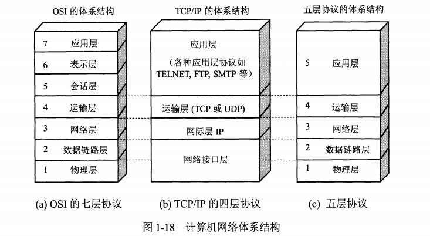

# Network

---

## OSI
1. 物理层

2. 数据链路层

3. 网络层

4. 运输层

5. 会话层

6. 表示层

7. 应用层

## 五层协议

1. 物理层            *网络线路*
2. 数据链路层    *ARP/VLAN/STP*
3. 网络层            *ICMP/IP/OSPF/BGP/IPSec/GRE*
4. 传输层           *TCP/UDP*
5. 应用层           *DHCP/HTTP/HTTPS/RTMP/P2P/DNS/GTP/RPC*

## TCP/IP四层协议
1. 网络接口层
2. 网际层IP
3. 运输层(TCP | UDP)
4. 应用层(TELNET | FTP | SMTP)

